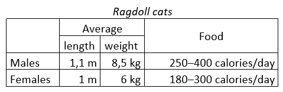

# Oefenreeks 2: HTML

## Oefening 1

* Start een nieuw webproject 'oefening_1', maak de standaard mappenstructuur aan en voeg een `index.html` toe met de basis html structuur.
* Voeg een webpaginatitel toe, een auteur en minstens 3 keywords.
* Plaats een 'Hello World!'-tekst in de browser.

## Oefening 2

* Start een nieuw webproject 'oefening_2' en voorzie de basis voor een goede webpagina.
* Voeg een div-container toe met:
    * 1 hoofding (header)
    * 2 paragrafen
    * 1 citaat (quote)
* Gebruik minimaal 2 tekstopmaakopties en 1 speciaal teken.

## Oefening 3

* Start een nieuw webproject 'oefening_3' en voorzie de basis voor een goede webpagina.
* Voeg een div-container toe met de klasse 'nav' die een ongeordende lijst bevat met 4 elementen die deel uitmaken van een navigatiemenu voor de webpagina.
    * Elk element is een hyperlink naar een andere webpagina, één daarvan opent in een nieuw tabblad.
* Voeg een div-container toe met:
    * 1 geordende lijst (Scores A..D met bijbehorende percentages. Bv. A = minstens 70%, B = minstens 50%, C= minstens 35% en D = minstens 0%)
    * 1 beschrijvende lijst met 5 vakken van je opleiding.
* Voeg een div-container toe met de klasse 'footer' die `Copyright <copyrightsymbool><huidig jaartal><jouw naam>` bevat, waarbij jouw naam een hyperlink is naar je e-mailadres.

## Oefening 4

* Start een nieuw webproject 'oefening_4' en voorzie de basis voor een goede webpagina.
* Zoek twee afbeeldingen op het internet en plaats deze in de juiste map in je webproject.
* Voeg een div-container toe die beide afbeeldingen bevat, waarvan één beperkt is tot bv. een grootte van 550x250 pixels.
* Voeg een werkende YouTube-video toe aan je pagina.

## Oefening 5

* Start een nieuw webproject 'oefening_5' en voorzie de basis voor een goede webpagina.
* Voeg een div-container toe met een tabel zoals in de onderstaande afbeelding:

Opmerking: HTML5 tekent standaard de lijnen niet, hiervoor is CSS nodig. Je hoeft je daar nu even niet van aan te trekken.

## Oefening 6

* Start een nieuw webproject 'oefening_6' en zorg voor de basis van een goede webpagina.
* Voeg een sectie toe met een formulier dat de volgende invoervelden bevat:
    * Voornaam
    * Naam
    * E-mail
    * Telefoon
    * Keuzelijst met opties: Klacht, Informatie, Offerte
    * Tekstblok om een bericht in te voeren
    * Een checkbox om de voorwaarden te aanvaarden
* Voorzie uiteraard ook een Verzend-knop.