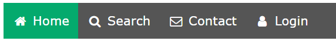
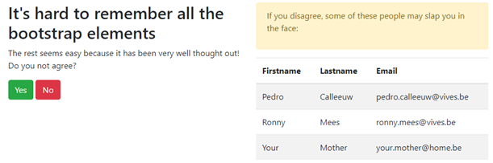
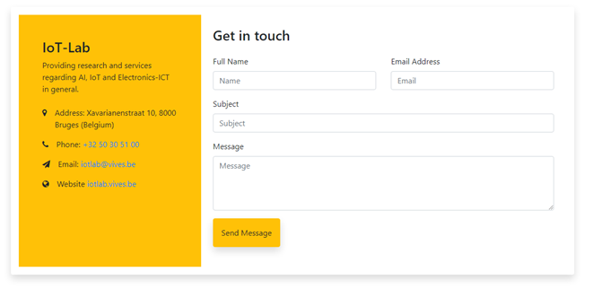

# Oefenreeks 4: Bootstrap

## Oefening 1

* Start een nieuw webproject 'oefening_1' en voorzie de basis voor een goede webpagina.
* Voeg 6 'tegels' toe die telkens een titel, een stukje tekst en een afbeelding bevatten. 
* De tegels worden in een bootstrap grid weergegeven, een beetje gelijkaardig aan onderstaande:

## Oefening 2

* Start een nieuw webproject 'oefening_2' en voorzie de basis voor een goede webpagina.
* Zorg voor een responsieve navigatiemenu met iconen zoals het voorbeeld hieronder. Als je scherm kleiner wordt (zoals bv. een smartphone), wijzigt het navigatiemenu in een icoon.

Opmerking: naast een CSS include van `bootstrap.min.css`, zal je ook een script include nodig hebben naar bv. `https://ajax.googleapis.com/ajax/libs/jquery/3.4.1/jquery.min.js` en naar `bootstrap.min.js`. Dit dient om het uitklappen van het menu mogelijk te maken.

## Oefening 3

* Start een nieuw webproject 'oefening_3' en voorzie de basis voor een goede webpagina.
* Bouw de volgende pagina door enkel gebruik te maken van HTML en Bootstrap, dus geen CSS:

## Oefening 4

* Start een nieuw webproject 'oefening_4' en voorzie de basis voor een goede webpagina.
* Bouw de volgende pagina door enkel gebruik te maken van HTML en Bootstrap, dus geen CSS:

## Oefening 5

* Start een nieuw webproject 'oefening_5' en voorzie de basis voor een goede webpagina.
* Bouw de volgende pagina door enkel gebruik te maken van HTML en Bootstrap, dus geen CSS:

