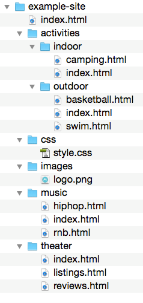

# Oefenreeks 5: Communicatie

Vervang `...` in de onderstaande vragen door jouw antwoord.

## Oefening 1

Een website heeft de volgende mappenstructuur:



* Je wilt de afbeelding `logo.png` gebruiken in het bestand `index.html` op het hoogste niveau. Schrijf de juiste source URL neer:
> ...

* Je wilt verwijzen naar `style.css` in het bestand `swim.html`. Schrijf de juiste source URL neer:
> ...

* Je wilt de afbeelding `logo.png` gebruiken in het bestand `hiphop.html`. Schrijf de juiste source URL neer:
> ...

## Oefening 2

* Een API stuurt je de gegevens van 3 metingen in JSON-formaat. Elke meting bevat:
    * een id: is een uniek nummer.
    * een datum: is de datum en tijd van de meting.
    * een frequentie: is een getal.
    * een amplitude: is ook een getal.
* De API stuurt eveneens de volgende informatie:
    * longitude: is de lengtegraad van de locatie van het meetpunt.
    * latitude: is de breedtegraad is van de locatie van het meetpunt.
    * naam: is de naam van de persoon die verantwoordelijk is voor de sensor.
* Probeer de JSON response van deze API uit te schrijven:

```json

...

```