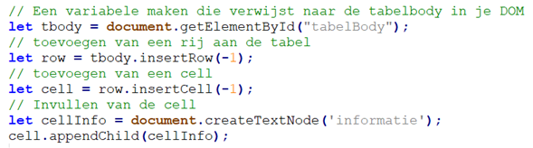
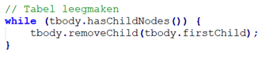

# Oefenreeks 7: Web API

Vervang `...` in de onderstaande vragen door jouw antwoord.

## Oefening 1

* Bestudeer de [MetalpriceAPI](https://metalpriceapi.com/documentation)-documentatie.
* Zoek uit hoe je deze API kunt gebruiken om de beschikbare munteenheden op te vragen en noteer de URL daarvoor. Noteer een stukje van de ontvangen response:
```
...

```

* Schrijf hieronder de juiste URL om de API te bevragen naar wisselkoers van 1 Euro naar US dollar, Britse pond en Zuid Afrikaanse Rand. 
> ...

Wat is de ontvangen response? 

```
...

```

* Doe nu hetzelfde, maar voor jouw vorige verjaardag.
> ...

```
...

```

* Wat gebeurt er als je een fout maakt in de URL? Wat is dan de ontvangen response? 

```
...

```

## Oefening 2

* Start een nieuw webproject 'oefening_2' en voorzie de basis van een goede webpagina.
* Voeg een tabel toe.
* Voeg een `script.js`-bestand toe.
* Bekijk nu de documentatie van [openweathermap.org API](https://openweathermap.org/forecast5).
* Vraag een gratis [API key](https://home.openweathermap.org/users/sign_up) aan en bekijk hoe je het weer kunt opvragen voor de komende 5 dagen per 3 uur **voor jouw woonplaats**. Ga na welke URL je moet gebruiken, welke parameters je moet opgeven, hoe de response eruit ziet enz.

    💡Het kan enkele uren tot zelfs dagen duren voordat je API key actief is.

* In je script roep je een functie aan die:
    * De informatie van deze API ophaalt via de *async/await*-techniek.
    * De titel van de woonplaats toont en vervolgens een tabel vult met minimaal deze info: datum en tijdstip, temperatuur (in °C), luchtvochtigheid (in %), windsnelheid (m/s) en neerslag (mm).

    💡 Tips:
    * Om de tabel te vullen kun je de volgende techniek gebruiken:
    
    * Om de tabel opnieuw leeg te maken kun je de volgende techniek gebruiken:
    

## Oefening 3

* Start een nieuw webproject 'oefening_3' en voorzie de basis van een goede webpagina.
* Voeg een div-element en knop toe aan de pagina.
* Voeg een `script.js`-bestand toe dat:
    * Een JSON-string definieert met de volgende gegevens van 5 steden:
        * Naam van de stad
        * Het aantal inwoners
        * De oppervlakte
    * Als je op de knop klikt, wordt deze JSON-string in een functie omgezet naar een object.
    * Maak nu via Google Charts een taartdiagram van het aantal inwoners/m² per stad.

## Oefening 4

* Start een nieuw webproject 'oefening_4' en voorzie de basis van een goede webpagina.
* Voeg een div-element en knop toe aan de pagina.
* Voeg een `script.js`-bestand toe dat:
    * Een JSON-string definieert met de omzet van de laatste 5 jaar van een bedrijf.
    * Wanneer op de knop wordt geklikt, zet een functie deze JSON-string om naar een object.
    * Maak nu via Google Charts hiervan een staafdiagram.

## Oefening 5

* Start een nieuw webproject 'oefening_5' en voorzie de basis van een goede webpagina.
* Voeg een div-element en knop toe aan de pagina.
* Voeg een `script.js`-bestand toe dat:
    * Een JSON-string definieert die de volgende meetpunten bevat *[leeftijd, gewicht]*: `[3, 3.5], [4, 5], [6.5, 7], [11, 14], [4, 5.5], [8, 12]`
    * Als je op de knop klikt, wordt deze JSON-string in een functie omgezet naar een object.
    * Gebruik Google Charts om een grafiek te maken die zowel de meetpunten als een polynomiale trendlijn toont.
