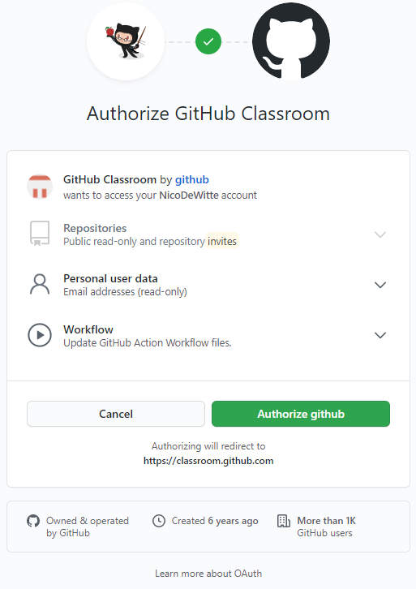
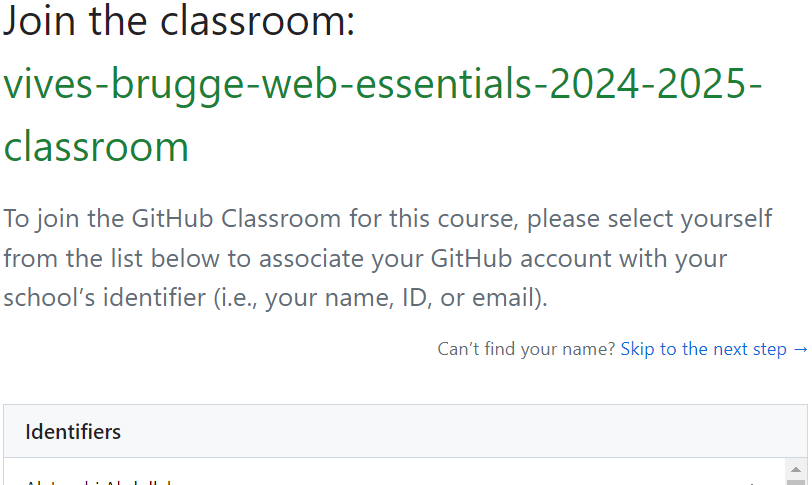

# Praktische zaken voor oefenreeksen Web Essentials

Deze repository bevat de reeks oefeningen die horen bij de Web Essentials cursus aan de VIVES Hogeschool in Brugge en is te vinden op [https://web-essentials-vives-brugge.netlify.app](https://web-essentials-vives-brugge.netlify.app).

Deze reeks bevat een `README.md` die de verschillende oefeningen voor die reeks beschrijft.

## Starten als student

Om te beginnen moet je eerst een kopie van deze repository krijgen. Volg de onderstaande stappen om je eigen persoonlijke kopie te krijgen. Dit hoeft maar één keer te worden gedaan.

1. Haal de GitHub classroom-uitnodigingslink van Toledo.
2. De eerste keer moet je GitHub Classroom toegang geven tot je GitHub-account. Klik op de knop `Authorize github`.



1. Zorg ervoor dat je je naam selecteert uit de lijst. Als je naam nog niet aanwezig is, kun je voorlopig op `Skip to the next step` klikken. Maar informeer in dat geval je docent.



4. Nu kun je de opdracht accepteren en wachten tot je eigen persoonlijke kopie is aangemaakt (dit kan enkele minuten duren - wees geduldig).

5. Open de GitHub-pagina van je repository.

6. Kopieer de ssh-clone-URL (groene knop) die er als volgt uitziet: `git@github.com:vives-brugge-web-essentials-2024-2025/oefenreeksen-<gebruikersnaam>.git`

7. Ga naar een lokale map op je systeem waar je de repository wilt klonen met behulp van Windows Verkenner. Open PowerShell in die locatie door <kbd>Shift</kbd> ingedrukt te houden en met de rechtermuisknop op de map te klikken. Selecteer vervolgens `Open PowerShell window here` in het contextmenu.
   
   *Kies alsjeblieft geen doelmap die diep genest is. De structuur van deze repository introduceert behoorlijk wat submappen en kan problemen veroorzaken met de maximale padlengte in Windows.*


8. Voer het `git clone`-commando in, gevolgd door de URL die je hebt gekopieerd (rechtermuisknop of <kbd>Ctrl</kbd> + <kbd>V</kbd> om te plakken).

```bash
git clone <plaats-ssh-url-hier>
```

Je zou een vergelijkbare uitvoer moeten zien:

```text
Cloning into 'oefenreeksen-LudovicEspeel'...
Warning: Permanently added the RSA host key for IP address '140.82.121.4' to the list of known hosts.
remote: Enumerating objects: 1241, done.
remote: Counting objects: 100% (1241/1241), done.
remote: Compressing objects: 100% (625/625), done.
remote: Total 1241 (delta 546), reused 1241 (delta 546), pack-reused 0
Receiving objects: 100% (1241/1241), 602.71 KiB | 1.77 MiB/s, done.
Resolving deltas: 100% (546/546), done.
```

Nu zou je je lokale kopie van de repository moeten hebben.

Alle git-commando's in andere secties moeten altijd worden uitgevoerd in de projectmap genaamd `oefenreeksen-<gebruikersnaam>`.

## Wijzigingen committen

Wijzigingen kunnen worden gecommit en terug gepusht naar GitHub met behulp van de terminal.

Navigeer naar je local oefenreeksen-<gebruikersnaam> map en open een PowerShell-venster door <kbd>Shift</kbd> ingedrukt te houden en met de rechtermuisknop op de map te klikken. Kies vervolgens Open PowerShell window here uit het contextmenu, zoals eerder gedaan in [sectie Starten als student](#starten-als-een-student).

1. Voeg alle gewijzigde bestanden toe met het commando: `git add .`
2. Commit de bestanden en voeg een bericht toe: git commit -m `Mijn bericht komt hier`

3. Push je wijzigingen naar GitHub: `git push origin master`

    

4. Om zeker te weten dat alles goed is gegaan, kun je altijd het commando git status uitvoeren, zelfs tussen andere commando's door.

Je kunt ook naar je GitHub-pagina van deze repo navigeren en controleren of alles goed is gegaan.

Maak er een gewoonte van om regelmatig te committen en te pushen. **Ten minste na het oplossen van elke opdracht.**

Bekijk ook de [verkorte versie van deze stappen voor dagelijks gebruik](./short_instructions.md).

## De laatste updates binnenhalen

Om de laatste updates binnen te halen, moet je eerst de originele repo toevoegen waarop deze gebaseerd is. Dit hoeft slechts één keer te worden gedaan voor elke gekloonde instantie:

```bash
git remote add base git@github.com:vives-brugge-web-essentials-2024-2025/oefenreeksen.git
```

`base` is de naam van de remote repo. Nu zou je twee remotes moeten zien wanneer je het commando git remote -v uitvoert. Bijvoorbeeld:

```text
base     git@github.com:vives-brugge-web-essentials-2024-2025/oefenreeksen.git (fetch)
base     git@github.com:vives-brugge-web-essentials-2024-2025/oefenreeksen.git (push)
origin  git@github.com:vives-brugge-web-essentials-2024-2025/oefenreeksen.git-LudovicEspeel.git (fetch)
origin  git@github.com:vives-brugge-web-essentials-2024-2025/oefenreeksen.git-LudovicEspeel.git (push)
```

Elke keer dat je updates wilt binnenhalen, moet je de volgende stappen volgen:

1. Zorg er eerst voor dat je geen lokale wijzigingen hebt. Dit kun je zien door het commando git status uit te voeren. Er zou moeten staan "nothing to commit, working tree clean". Zo niet, dan moet je eerst de wijzigingen toevoegen en committen (zie sectie[Wijzigingen committen](#wijzigingen-committen)).
2. Voer nu het commando git pull base master --allow-unrelated-histories uit om de nieuwste wijzigingen binnen te halen.


Zorg ervoor dat je geen conflicten hebt voordat je alles commit.

Bekijk ook de [verkorte versie van deze stappen voor dagelijks gebruik](./short_instructions.md).

## Overzicht progressie

Peef aan welke uitdagingen je hebt voltooid door een ✔️ emoji te plaatsen in de "voltooid"-kolom van het PROGRESS.md-bestand.